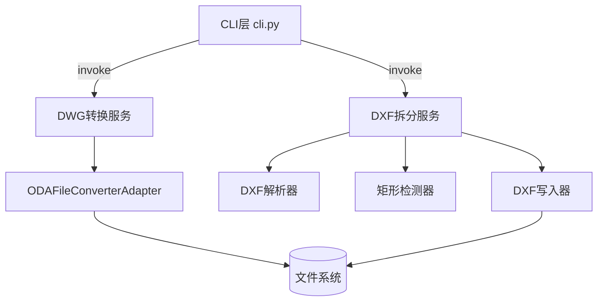

# cad-drawing-processor 设计方案

## Overview
实现一个 Python 命令行工具链，包含两个子命令：`convert` 用于批量将 DWG 转换为 DXF（依赖外部 ODAFileConverter）；`split` 负责解析 DXF 并基于矩形方框拆分成子 DXF。目标是提供简单可维护的模块化结构，确保核心逻辑（转换、解析、拆分、日志）解耦，CLI 仅负责参数与流程编排。

## Steering Document Alignment
仓库当前无 steering 文档，设计遵循通用工程约束并延续 SOLID/KISS/DRY/YAGNI 原则。

### Technical Standards (tech.md)
- 语言选用 Python 3.10+，便于跨平台部署与依赖管理。
- 依赖管理使用 `requirements.txt`，通过 `venv`/`pip` 安装。
- CLI 框架选用 `typer`（基于 `click`），提供子命令结构与自动帮助信息。
- 终端输出可选 `rich` 增强日志/表格展示，但保证在纯文本环境下也可运行。
- 日志采用标准库 `logging`，输出到终端与可选文件，必要时与 `rich` 集成。

### Project Structure (structure.md)
- 源码放置于 `src/caddxftool/` 包，入口 CLI 位于 `src/caddxftool/cli.py`，遵循 package + console script 结构。
- 测试置于 `tests/`，使用 `pytest`，样例数据放入 `fixtures/`。
- 文档（如 README）位于仓库根目录。

## Code Reuse Analysis
仓库已被清空，无可复用代码。所有模块需全新实现。

### Existing Components to Leverage
- 无。

### Integration Points
- **外部命令**：`ODAFileConverter` CLI，用于 DWG→DXF。通过可配置路径调用并处理返回码，支持跨平台参数（Windows `/regserver`、mac/Linux `-platform`）。
- **文件系统**：输入/输出目录与临时文件操作。
- **第三方库**：
  - `ezdxf`：读取/写入 DXF，处理实体与图层。
  - `shapely`：按矩形边界进行多边形包含计算，确保复杂实体（圆弧、文本）准确判断是否落入方框范围。
  - `numpy`：在矩形检测阶段用于向量运算与数值容差控制。
  - `typer` / `rich`：CLI 交互与友好输出。

## Architecture
采用分层结构：CLI 层（解析参数/调度）、应用服务层（转换与拆分流程）、领域层（几何解析、实体过滤、DXF 写入）、基础设施层（外部命令调用、文件系统操作、日志）。

### Modular Design Principles
- **Single File Responsibility**：每个模块聚焦单一职责，例如 `converter.py` 仅处理 DWG→DXF。
- **Component Isolation**：CLI 与核心逻辑隔离，便于测试核心逻辑。
- **Service Layer Separation**：`services/` 封装业务流程，内部使用 `adapters/` 进行外部交互。
- **Utility Modularity**：通用功能如路径与日志封装在 `utils/`。



## Components and Interfaces

### `caddxftool.cli`
- **Purpose:** 提供命令行入口，解析参数，调用相应服务。
- **Interfaces:** `main(argv: list[str]) -> int`；两个子命令 `convert`、`split`。
- **Dependencies:** `typer`、`ConvertService`、`SplitService`、`logging`/`rich`。
- **Reuses:** 服务层与 utils。

### `caddxftool.services.convert_service`
- **Purpose:** 遍历输入目录、调用外部转换器、处理日志与失败记录。
- **Interfaces:** `run(config: ConvertConfig) -> ConvertReport`。
- **Dependencies:** `ODAFileConverterAdapter`、`PathResolver`、`logging`。
- **Reuses:** 配置与结果数据类。

### `caddxftool.adapters.oda_converter`
- **Purpose:** 封装 ODAFileConverter 命令调用，处理环境变量、路径、返回码。
- **Interfaces:** `convert(dwg_path: Path, output_dir: Path, overwrite: bool) -> ConvertResult`。
- **Dependencies:** `subprocess`, `shutil`.
- **Reuses:** 无。

### `caddxftool.services.split_service`
- **Purpose:** 针对单个 DXF 文件解析矩形方框并生成子 DXF。
- **Interfaces:** `run(config: SplitConfig) -> SplitReport`。
- **Dependencies:** `DXFReader`、`RectangleDetector`、`DXFWriter`。
- **Reuses:** 模型与工具。

### `caddxftool.dxf.reader`
- **Purpose:** 使用 `ezdxf` 读取 DXF，抽取图层及实体集合。
- **Interfaces:** `load(path: Path) -> DrawingContext`。
- **Dependencies:** `ezdxf`.

### `caddxftool.dxf.rectangle_detector`
- **Purpose:** 从实体集合中识别闭合矩形（支持 `LWPOLYLINE` / `POLYLINE`）。
- **Interfaces:** `find_rectangles(ctx: DrawingContext) -> list[RectangleRegion]`。
- **Dependencies:** `numpy` 用于向量计算，`shapely.geometry.Polygon` 校验矩形合法性并提供包含判断。

### `caddxftool.dxf.writer`
- **Purpose:** 根据矩形区域筛选实体并写入新的 DXF。
- **Interfaces:** `write_sub_dxf(ctx: DrawingContext, region: RectangleRegion, output_path: Path)`.
- **Dependencies:** `ezdxf`、`shapely`（用于判断实体是否在区域内）。

### `caddxftool.models`
- **Purpose:** 保存配置与结果数据结构。
- **Interfaces:** `ConvertConfig`, `SplitConfig`, `ConvertReport`, `SplitReport`, `RectangleRegion` 等 dataclass。
- **Dependencies:** `dataclasses`, `pathlib`.

### `caddxftool.utils.logging`
- **Purpose:** 初始化统一的日志格式，支持文件输出。
- **Interfaces:** `setup_logging(level: str, log_file: Path | None)`.
- **Dependencies:** `logging`.

## Data Models

### `ConvertConfig`
```
ConvertConfig:
  input_dir: Path
  output_dir: Path
  overwrite: bool
  oda_path: Path | None
```

### `SplitConfig`
```
SplitConfig:
  source_file: Path
  output_dir: Path
  include_frame: bool
  naming_pattern: str  # e.g. "{name}_region_{index}.dxf"
```

### `RectangleRegion`
```
RectangleRegion:
  id: str
  min_x: float
  min_y: float
  max_x: float
  max_y: float
  layer: str | None
```

### `ConvertReport` / `SplitReport`
```
ConvertReport:
  total: int
  success: int
  failed: list[FailedItem]

FailedItem:
  source: Path
  error: str
```

## Error Handling

### Error Scenarios
1. **ODAFileConverter 未安装或路径错误**
   - **Handling:** 抛出自定义异常 `ExternalToolError`，CLI 捕获后输出中文错误提示并返回非零码。
   - **User Impact:** 用户看到“找不到 ODAFileConverter，请检查路径设置”。

2. **DXF 无法解析（损坏或不受支持）**
   - **Handling:** `DXFReader` 捕获 `ezdxf.DXFError`，写入报告并继续下一个文件。
   - **User Impact:** 提示“解析失败，已跳过”，不影响其他文件。

3. **未检测到矩形方框**
   - **Handling:** `SplitService` 记录警告并返回空输出，但流程成功结束。
   - **User Impact:** 终端提示“未找到方框，未生成子文件”。

4. **输出目录已存在同名文件且未启用覆盖**
   - **Handling:** 抛出 `FileExistsError`，记录失败项。
   - **User Impact:** 提示“文件已存在，使用 --overwrite 以覆盖”。

## Testing Strategy

### Unit Testing
- 对 `rectangle_detector` 的几何识别逻辑编写单元测试，覆盖直角矩形、嵌套、重叠、无矩形等情形。
- 测试 `oda_converter` 对命令构建、错误码解析和异常处理（通过 mock `subprocess`）。
- 验证 `SplitService` 的实体筛选与命名规则（使用轻量 DXF fixture）。

### Integration Testing
- 构造小型 DXF 示例，执行 `split` 命令（通过 `CliRunner` 或 `subprocess`）验证多矩形拆分输出。
- 对 `convert` 命令使用假外部工具（mock 脚本）验证批处理错误收集。

### End-to-End Testing
- 使用示例目录（DWG 替换为模拟脚本）跑完整 CLI，检查日志、报告与输出结构。
- 若可获取真实 DWG/DXF 样例，在 CI 或手动环境验证真实转换链路。
