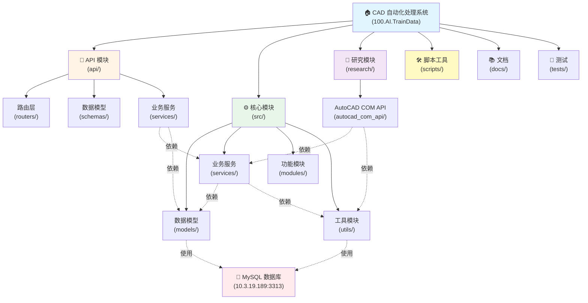

# CLAUDE.md

This file provides guidance to Claude Code (claude.ai/code) when working with code in this repository.

## 变更记录 (Changelog)

### 2025-11-05 08:51:14 - 架构文档全面更新（阶段 B 完成）

**由 Claude Code 自动生成**

**扫描统计：**
- 扫描文件数：95/150 (63%)
- Python 文件：89 个
- Markdown 文档：59 个
- 配置文件：1 个 YAML + 19 个 JSON
- Shell 脚本：12 个

**模块覆盖率：**
- api/ - 100% ✅ 完整扫描，已生成详细文档
- src/ - 95% ✅ 核心层完整，modules 部分缺失
  - models/ - 100% ✅ 5 个数据模型全部扫描
  - services/ - 100% ✅ 4 个服务全部扫描
  - utils/ - 100% ✅ 5 个工具模块全部扫描
  - modules/ - 30% ⚠️ 仅 1 个模块，缺少上传和监控
- research/ - 70% ⚠️ 生产代码已扫描，历史代码已编目
- scripts/ - 80% 📋 34 个脚本已分类编目
- docs/ - 100% 📋 56 个文档已分类编目
- tests/ - 10% ❌ 仅 1 个测试文件，覆盖率极低

**更新内容：**
- 深度扫描核心模块（src/models, src/services, src/utils）
- 分析 AutoCAD 工作流系统（enhanced_workflow.py）
- 识别数据库表结构和关系（6 个核心表）
- 分类脚本工具（5 大类，34 个脚本）
- 更新模块索引和依赖关系图
- 生成完整的 `.claude/index.json` 索引文件

**识别的关键技术：**
- AutoCAD COM API 自动化（pywin32）
- UI 自动化（pywinauto + pyautogui）
- OCR 识别（UMI-OCR/Tesseract/EasyOCR）
- 数据库配置驱动系统（JSON 存储操作序列）
- 三阶段工作流（前置/主流程/后置）
- 变量系统（OCR 提取值保存和引用）

**主要缺口：**
1. src/modules/ 缺少上传和监控模块（优先级：高）
2. tests/ 测试覆盖率极低（优先级：高）
3. research/_archived/ 部分历史代码缺注释（优先级：低）

**下一步建议：**
- 补充 src/modules/uploader.py 和 file_monitor.py
- 增加单元测试覆盖率（目标 60%+）
- 为 enhanced_workflow.py 添加更多示例配置
- 深度扫描 research/autocad_com_api/ 了解实现细节

---

### 2025-11-04 21:15:53 - 架构文档初始化（阶段 A 完成）

**由 Claude Code 自动生成**

- 添加了完整的项目架构索引（`.claude/index.json`）
- 生成了模块结构 Mermaid 图表
- 创建了详细的模块索引表格
- 统计了代码覆盖率：89/150 文件（59%）
- 识别了 10 个主要模块和子模块
- 标注了技术栈和核心依赖

**下一步建议：**
- 深度扫描 `research/autocad_com_api/` 了解实现细节
- 为核心模块添加单元测试
- 补充 `src/modules/` 中缺失的文件监控和上传模块

---

## 项目概述

这是一个 **CAD 文件自动化处理系统**,用于从远程服务器下载 DWG 文件,使用 AutoCAD COM API 自动化处理,并上传结果。

**核心技术栈:**
- **Python 3.9+** - 主开发语言
- **FastAPI** - HTTP API 服务框架
- **SQLAlchemy 2.0+** - 数据库 ORM
- **MySQL** - 数据库 (默认: 10.3.19.189:3313/cad_mgt)
- **pywin32** - Windows COM 自动化 (AutoCAD 控制)
- **pyautogui/pywinauto** - UI 自动化
- **Tesseract/EasyOCR/UMI-OCR** - OCR 文本识别

## 模块结构图

下图展示了项目的核心模块及其依赖关系：



## 模块索引

| 模块路径 | 类型 | 语言 | 职责描述 | 关键文件数 | 覆盖状态 |
|---------|------|------|---------|-----------|---------|
| **[api/](./api/CLAUDE.md)** | HTTP服务 | Python | FastAPI HTTP 服务层，提供 RESTful API 接口 | 11 | ✅ 完整 |
| **[src/](./src/CLAUDE.md)** | 核心业务 | Python | 核心业务逻辑层，包含数据模型、服务和工具 | 19 | ✅ 完整 |
| **├─ [src/models/](./src/models/CLAUDE.md)** | 数据层 | Python | SQLAlchemy ORM 数据库模型定义 | 5 | ✅ 完整 |
| **├─ [src/services/](./src/services/CLAUDE.md)** | 业务逻辑 | Python | 业务服务层，封装核心业务逻辑 | 4 | ✅ 完整 |
| **├─ [src/modules/](./src/modules/CLAUDE.md)** | 功能模块 | Python | 功能模块（下载、上传、监控） | 1 | ⚠️ 部分 |
| **├─ [src/utils/](./src/utils/CLAUDE.md)** | 工具模块 | Python | 工具模块（配置、日志、数据库等） | 5 | ✅ 完整 |
| **[research/](./research/CLAUDE.md)** | 实验代码 | Python | AutoCAD COM API 研究和实验 | 13 | ⚠️ 部分 |
| **[scripts/](./scripts/CLAUDE.md)** | 脚本工具 | Python | 数据库初始化、配置管理、测试工具 | 34 | 📋 已编目 |
| **[docs/](./docs/)** | 文档 | Markdown | 项目文档和使用指南 | 56 | 📋 已编目 |
| **[tests/](./tests/)** | 测试 | Python | 测试代码 | 1 | ❌ 最少 |

**图例说明：**
- ✅ 完整 - 已深度扫描，文档完整
- ⚠️ 部分 - 已扫描但存在缺口
- 📋 已编目 - 已统计但未深度扫描
- ❌ 最少 - 覆盖率不足

## 常用命令

### 环境设置

```bash
# 创建虚拟环境
python -m venv venv

# 激活虚拟环境 (Windows)
venv\Scripts\activate

# 安装依赖
pip install -r requirements.txt

# 安装 API 相关依赖
# Windows: install_api_deps.bat
# Linux/Mac: ./install_api_deps.sh
```

### 数据库初始化

```bash
# 初始化任务管理表
python scripts/init_task_tables.py

# 初始化 AutoCAD 配置表
python scripts/init_autocad_config.py

# 初始化数据库(通用)
python scripts/init_database.py

# 查看/管理 AutoCAD 配置
python scripts/autocad_config_manager.py list
python scripts/autocad_config_manager.py get <config_name>
```

### 启动服务

```bash
# 启动 HTTP API 服务 (推荐)
# Windows: start_api.bat
# Linux/Mac: ./start_api.sh
# 手动启动: uvicorn api.main:app --host 0.0.0.0 --port 8000 --reload

# API 文档地址
# - Swagger UI: http://localhost:8000/docs
# - ReDoc: http://localhost:8000/redoc
# - 健康检查: http://localhost:8000/health
```

### 测试

```bash
# 运行所有测试
pytest

# 运行特定测试文件
pytest tests/test_downloader.py

# 带覆盖率报告
pytest --cov=src --cov-report=html

# 测试 API
python scripts/test_api.py
python test_bplot_api.py
```

### AutoCAD 工作流测试

```bash
# 可配置工作流 (基于数据库配置)
python research/autocad_com_api/9_configurable_workflow.py

# BPLOT 自动化工作流
python research/autocad_com_api/10_bplot_workflow.py
python research/autocad_com_api/11_bplot_auto_workflow.py

# 增强型工作流 (支持前置/主流程/后置操作)
python research/autocad_com_api/enhanced_workflow.py
```

### 工具脚本

```bash
# OCR 相关
python scripts/check_ocr_logs.py
python scripts/pdf_ocr_with_umi.py
python scripts/extract_drawing_info.py
python scripts/batch_extract_info.py

# 配置检查
python scripts/check_config_format.py
python scripts/check_bplot_dependencies.py
python scripts/verify_bplot_enhanced.py
python scripts/verify_workflow_config.py

# 数据库迁移
python scripts/auto_migrate.py
python scripts/migrate_ocr_logging.py
python scripts/migrate_add_output_dir_cleanup.py
```

## 核心架构

### 目录结构

```
├── api/                          # FastAPI HTTP 服务
│   ├── main.py                   # API 入口
│   ├── routers/                  # 路由: tasks.py, health.py
│   ├── schemas/                  # Pydantic 模型
│   └── services/                 # 业务服务
├── src/                          # 核心业务逻辑
│   ├── models/                   # SQLAlchemy 数据库模型
│   │   ├── autocad_config.py     # AutoCAD 配置表
│   │   ├── dwg_process_task.py   # DWG 任务表
│   │   ├── dwg_task_step.py      # 任务步骤日志
│   │   ├── dictionary.py         # 字典表
│   │   └── ocr_recognition_log.py # OCR 识别日志
│   ├── modules/                  # 功能模块
│   │   └── downloader.py         # 文件下载器
│   ├── services/                 # 业务服务
│   │   ├── autocad_config_service.py  # AutoCAD 配置管理
│   │   ├── task_service.py            # 任务管理
│   │   ├── dict_service.py            # 字典服务
│   │   └── ocr_logging_service.py     # OCR 日志服务
│   └── utils/                    # 工具模块
│       ├── config.py             # 配置管理 (YAML)
│       ├── database.py           # 数据库管理 (单例)
│       ├── logger.py             # 日志工具
│       ├── image_processing.py   # 图像预处理
│       └── ocr_file_manager.py   # OCR 文件管理
├── research/                     # 研究和实验代码
│   └── autocad_com_api/          # AutoCAD COM API 研究
│       ├── 9_configurable_workflow.py    # 可配置工作流
│       ├── 10_bplot_workflow.py          # BPLOT 工作流
│       ├── 11_bplot_auto_workflow.py     # BPLOT 自动化
│       └── enhanced_workflow.py          # 增强型工作流
├── scripts/                      # 脚本工具
├── config/                       # 配置文件
│   └── config.yaml.example       # 配置模板
├── docs/                         # 文档
└── data/                         # 数据目录 (运行时创建)
    ├── downloads/                # 下载文件
    ├── processing/               # 处理中文件
    ├── outputs/                  # 输出文件
    └── backup/                   # 备份文件
```

### 数据库模型关系

**核心表:**
- `autocad_configs` - AutoCAD 配置 (JSON 格式存储操作序列)
- `dwg_process_tasks` - DWG 处理任务 (状态追踪)
- `dwg_task_steps` - 任务步骤日志 (详细记录)
- `dict_preprocessing` - 图像预处理配置字典
- `ocr_recognition_logs` - OCR 识别日志

**配置系统:**
- 所有 AutoCAD 自动化参数存储在 `autocad_configs` 表
- 支持多配置方案: `default`, `fast`, `stable`, `with_menu_operations`
- 操作序列以 JSON 格式存储在 `menu_operations` 字段

### AutoCAD 工作流系统

项目支持三种工作流模式:

1. **可配置工作流** (`9_configurable_workflow.py`)
   - 基于数据库配置驱动
   - 从 `autocad_configs` 表读取配置
   - 支持菜单点击、命令执行、等待操作

2. **BPLOT 工作流** (`10_bplot_workflow.py`, `11_bplot_auto_workflow.py`)
   - 专门用于批量绘图 (Batch Plot)
   - 集成 OCR 识别菜单和按钮
   - 支持自动图框识别和 PDF 生成

3. **增强型工作流** (`enhanced_workflow.py`) ⭐
   - **最完整的实现**
   - 支持前置/主流程/后置三阶段操作
   - 操作类型:
     * `command` - AutoCAD 命令
     * `menu` - OCR 菜单点击
     * `input` - 键盘输入
     * `screenshot_extract` - OCR 信息提取
     * `system_command` - 系统命令
     * `directory_cleanup` - 目录清理
     * `file_monitor` - 文件监控
   - 变量系统 (保存和引用 OCR 提取值)
   - 详细日志记录到数据库

**工作流配置格式 (JSON):**

```json
{
  "前置操作": [
    {
      "type": "directory_cleanup",
      "path": "C:\\output",
      "description": "清理输出目录"
    }
  ],
  "主流程": [
    {
      "type": "command",
      "command": "_OPEN",
      "description": "打开文件"
    },
    {
      "type": "menu",
      "text": "批量打印",
      "click_offset": [0, 0],
      "timeout": 10,
      "description": "点击批量打印菜单"
    },
    {
      "type": "screenshot_extract",
      "region": [100, 200, 300, 250],
      "extract_pattern": "图纸数量:\\s*(\\d+)",
      "save_to_var": "sheet_count",
      "description": "提取图纸数量"
    }
  ],
  "后置操作": [
    {
      "type": "file_monitor",
      "watch_directory": "C:\\output",
      "expected_count": "${sheet_count}",
      "timeout": 600,
      "description": "监控 PDF 生成"
    }
  ]
}
```

### 配置管理

**配置文件:** `config/config.yaml`

关键配置节:
- `database` - MySQL 连接配置
- `server` - 远程 API 配置
- `paths` - 文件路径配置
- `autocad` - AutoCAD 基础配置
- `monitor` - 文件监控配置
- `upload` - 上传配置
- `logging` - 日志配置
- `task` - 任务管理配置

**环境变量覆盖:**
使用 `CAD_` 前缀覆盖配置,例如:
```bash
export CAD_SERVER_BASE_URL=http://localhost:8000
export CAD_LOGGING_LEVEL=DEBUG
```

### 数据库连接

**单例模式管理:**
```python
from src.utils.database import get_db_manager, db_session

# 方式1: 使用上下文管理器
with db_session() as session:
    result = session.query(Model).all()

# 方式2: 手动获取会话
db_manager = get_db_manager()
session = db_manager.get_session()
# ... 使用 session
session.close()
```

**测试连接:**
```python
python src/utils/database.py
```

### OCR 识别系统

项目集成了 UMI-OCR API 进行菜单和按钮识别:

**OCR 服务配置:** (在 `autocad_configs` 表中)
- `ocr_server_url` - OCR 服务地址 (默认: `http://127.0.0.1:1224/api/ocr`)
- `preprocessing_dict_key` - 预处理配置键

**预处理字典:** `dict_preprocessing` 表
- 存储图像预处理配置 (缩放、去噪、对比度等)
- 按 `dict_key` 查询配置

**OCR 识别流程:**
1. 截取屏幕区域
2. 根据预处理配置优化图像
3. 调用 UMI-OCR API 识别文本
4. 匹配目标文本并计算点击坐标
5. 记录识别结果到 `ocr_recognition_logs` 表

**相关文档:**
- `docs/UMI_OCR_API_GUIDE.md` - UMI-OCR 使用指南
- `docs/image_preprocessing_guide.md` - 图像预处理指南
- `docs/ocr_preprocessing_config_guide.md` - 预处理配置指南

## 重要注意事项

### Windows 特定要求

- **必须在 Windows 上运行** - AutoCAD COM API 仅支持 Windows
- **需要安装 AutoCAD** - 默认路径: `C:\Program Files\Autodesk\AutoCAD 2024`
- **管理员权限** - 某些 UI 自动化操作可能需要管理员权限

### 路径处理

- **始终使用双引号** 包裹文件路径
- **优先使用正斜杠** `/` 作为路径分隔符
- **支持跨平台兼容** (尽管主要在 Windows 上运行)

示例:
```python
# 正确
file_path = "C:/Program Files/AutoCAD/drawing.dwg"
os.system(f'autocad.exe "{file_path}"')

# 错误
file_path = C:\Program Files\AutoCAD\drawing.dwg  # 缺少引号
```

### 数据库操作

- **总是使用上下文管理器** `with db_session()` 自动管理事务
- **异常会自动回滚** - 不需要手动 rollback
- **会话在 finally 块关闭** - 避免连接泄漏

### AutoCAD COM 注意事项

- **COM 对象生命周期** - 使用完必须释放 (`acad = None`)
- **异步操作** - 某些命令需要等待完成
- **窗口焦点** - UI 操作需要 AutoCAD 窗口在前台
- **进程清理** - 失败后要确保 AutoCAD 进程被关闭

### 配置驱动开发

**核心原则:** 所有自动化流程参数应存储在数据库,而非硬编码

- 使用 `autocad_configs` 表存储工作流配置
- 使用 `dict_preprocessing` 表存储 OCR 预处理配置
- 使用 `config.yaml` 存储环境相关配置

**添加新配置:**
```bash
# 使用配置管理工具
python scripts/autocad_config_manager.py add <config_name>
```

### 日志记录

项目使用两层日志系统:

1. **应用日志** - `loguru` (文件: `logs/cad_processor_*.log`)
2. **数据库日志** - SQLAlchemy (任务步骤记录到 `dwg_task_steps`)

**关键日志级别:**
- `DEBUG` - 详细调试信息
- `INFO` - 正常操作信息 (默认)
- `WARNING` - 警告但不影响运行
- `ERROR` - 错误但可恢复
- `CRITICAL` - 严重错误,需要立即处理

### 错误处理

- **重试机制** - 使用 `tenacity` 库自动重试
- **超时控制** - 所有长时间操作都有超时设置
- **失败恢复** - 任务失败会记录状态,支持恢复
- **详细日志** - 异常堆栈记录到数据库

## 开发工作流

### 添加新的 AutoCAD 操作类型

1. 在 `enhanced_workflow.py` 的 `_execute_operation()` 添加新的 `type` 分支
2. 实现对应的私有方法 (例如: `_execute_new_operation()`)
3. 更新配置文档和数据库示例
4. 编写测试脚本验证

### 添加新的 API 端点

1. 在 `api/schemas/` 创建 Pydantic 模型
2. 在 `api/routers/` 创建路由文件
3. 在 `api/services/` 实现业务逻辑
4. 在 `api/main.py` 注册路由
5. 使用 Swagger UI 测试 (`/docs`)

### 数据库表更新

1. 修改 `src/models/` 中的模型定义
2. 创建迁移脚本 `scripts/migrate_*.py`
3. 运行迁移脚本
4. 更新相关服务代码
5. 测试数据完整性

## 故障排查

### 常见问题

**1. AutoCAD 无法启动**
- 检查 AutoCAD 路径配置
- 确认 AutoCAD 许可有效
- 查看系统事件日志

**2. OCR 识别失败**
- 确认 UMI-OCR 服务运行 (http://127.0.0.1:1224)
- 检查预处理配置是否适合当前 UI
- 查看 `ocr_recognition_logs` 表的失败日志

**3. 数据库连接失败**
- 检查 MySQL 服务状态
- 验证 `config.yaml` 中的数据库配置
- 测试网络连接: `telnet 10.3.19.189 3313`

**4. 文件监控超时**
- 增加 `timeout` 配置
- 检查 AutoCAD 是否实际生成文件
- 查看文件路径是否正确

### 调试技巧

```bash
# 启用详细日志
export CAD_LOGGING_LEVEL=DEBUG

# 干运行模式 (不实际执行)
export CAD_DEBUG_DRY_RUN=true

# 保存中间文件
export CAD_DEBUG_KEEP_INTERMEDIATE_FILES=true
```

**查看实时日志:**
```bash
tail -f logs/cad_processor_*.log
```

**查看任务执行详情:**
```sql
-- 查看任务状态
SELECT * FROM dwg_process_tasks ORDER BY created_at DESC LIMIT 10;

-- 查看任务步骤
SELECT * FROM dwg_task_steps WHERE task_id = '<task_id>' ORDER BY step_number;

-- 查看 OCR 识别记录
SELECT * FROM ocr_recognition_logs ORDER BY created_at DESC LIMIT 20;
```

## 相关文档

- `README.md` - 项目主文档
- `QUICK_START.md` - 快速开始指南
- `docs/API_GUIDE.md` - HTTP API 使用指南
- `docs/DATABASE_CONFIG_GUIDE.md` - 配置系统详细指南
- `docs/BPLOT_AUTO_WORKFLOW_GUIDE.md` - BPLOT 自动化工作流指南
- `docs/ENHANCED_WORKFLOW_GUIDE.md` - 增强型工作流指南
- `docs/MENU_OPERATIONS_GUIDE.md` - 菜单操作配置指南
- `docs/UMI_OCR_API_GUIDE.md` - UMI-OCR 集成指南

## 项目状态

当前版本: **0.3.0** (开发中)

最近更新:
- ✅ HTTP API 服务 (FastAPI)
- ✅ 增强型工作流 (支持前置/主流程/后置)
- ✅ OCR 识别集成 (UMI-OCR)
- ✅ 数据库配置驱动
- ✅ 任务管理与日志系统
- 🚧 文件下载模块 (60%)
- ⏳ 文件监控 (待开始)
- ⏳ 结果上传 (待开始)

## 联系和支持

- **问题反馈:** GitHub Issues
- **技术支持:** 查看 `docs/` 目录文档
- **AI 协助开发:** 本项目使用 Claude Code 协助开发

---

**最后更新:** 2025-11-05
**维护者:** 老王团队 - 专业暴躁技术流 🔧
