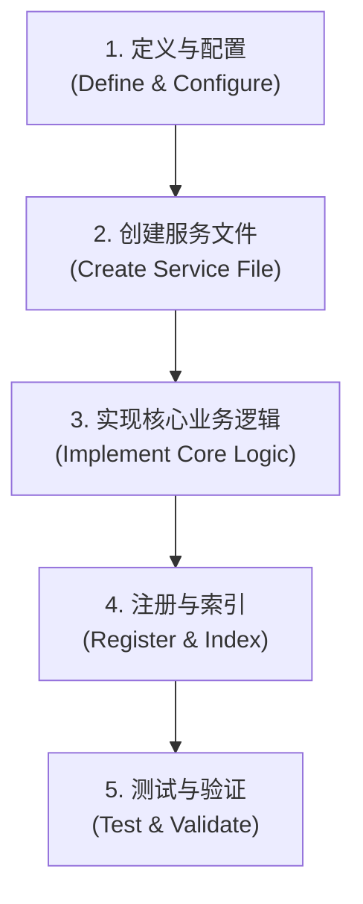

# 新业务对象集成标准操作流程 (SOP)

## 1. 引言

本文档旨在提供一个标准化的、可重复的流程，用于将一个新的数据生成服务高效地集成到本项目中。遵循此流程可以确保代码的一致性、可维护性和健壮性。

## 2. 流程概述

整个集成过程分为五个核心步骤，如下图所示：



## 3. 前置条件 (Prerequisites)

在开始之前，请确保您已准备好以下信息：

- **新业务对象的唯一名称**: 遵循驼峰命名法，例如 `submitVpoMaterial`。
- **详细的业务规则定义**: 一份清晰的文档（格式不限），详细描述新业务的数据要素、组合逻辑和解析格式。这是实现核心业务逻辑的唯一依据。
    - **建议**: 如果业务逻辑复杂，建议先与AI助手（我）讨论规则定义，以确保其清晰度和可实现性。

## 4. 分步详解 (Step-by-Step Guide)

### 步骤 1: 配置准备 (Configuration Setup)

**目标**: 为新业务对象创建所有必需的JSON配置文件。

**操作**:

在 `src/entity/` 目录下，找到对应的子目录并创建以下文件（以 `newObject` 为例）：

1.  **基础元素定义**: `src/entity/baseElements/newObject.json`
    - **作用**: 定义构成问题的基本元素（词条、短语等）。
    - **模板**:
      ```json
      {
        "businessObject": "newObject",
        "baseDataList": [
          {
            "name": "elementName",
            "number": "01",
            "conditionList": ["value1", "value2"],
            "originalText": "value1/value2",
            "originalLogic": "无",
            "originalRegex": "",
            "dictlist": []
          }
        ]
      }
      ```

2.  **答案元素定义**: `src/entity/answerElements/newObject.json`
    - **作用**: 定义最终生成的答案JSON的结构和字段映射关系。
    - **模板**:
      ```json
      {
        "answerObject": "newObject",
        "answerElements": [
          {
            "name": "fieldName",
            "nameCN": "中文字段名",
            "relateToBase": "01",
            "isStatic": "否",
            "staticValue": null
          }
        ]
      }
      ```

3.  **规则定义**: `src/entity/relationship/newObjectRules.json`
    - **作用**: 定义基础元素如何组合成有效的问题。
    - **模板**:
      ```json
      {
        "rulesMap": [
          {
            "id": 1,
            "name": "规则描述",
            "codebase": "01;02",
            "codecount": 2,
            "codeList": [
              "01;02"
            ]
          }
        ]
      }
      ```

### 步骤 2: 服务创建 (Service Creation)

**目标**: 创建一个新的服务文件，并设置好基本的类结构。

**操作**:

1.  **复制模板**: 复制标准的服务模板文件 `src/service/submitvposent_service.py`。
2.  **重命名**: 将复制的文件重命名为 `src/service/newObject_service.py`。
3.  **修改内容**: 打开新文件，修改以下两处：
    - 将类名 `SubmitVposentService` 修改为 `NewObjectService`。
    - 将 `BUSINESS_OBJECT` 常量的值修改为 `"newObject"`。 

### 步骤 3: 核心逻辑实现 (Core Logic Implementation)

**目标**: 在新创建的服务文件中，实现该业务对象特有的数据处理逻辑。

**说明**: 这是整个流程中唯一需要编写核心Python代码的步骤。您需要将业务规则文档中的解析逻辑，转换为 `post_process_data` 方法中的代码。

**操作**:

打开 `src/service/newObject_service.py` 文件，找到 `post_process_data` 方法，并根据您的业务规则填充其逻辑。

- **伪代码框架**:
  ```python
  def post_process_data(self, data, answer_elements=None):
      # ... (方法头部，处理列表输入的逻辑已由模板提供) ...

      for item in data:
          # ... (字段初始化逻辑已由模板提供) ...

          # 在这里开始填充您的特有逻辑
          # 例如：从 item['question'] 中提取特定字段
          if "your_specific_field" in item['question']:
              # ... 进行处理，并设置 item['answer'] 中的对应字段 ...
              item['answer']['targetField'] = processed_value

          # ... (其他业务逻辑) ...

      return data
  ```

#### 3.1 如何解读规则并转换为代码

这是将业务需求转化为代码的关键。核心是理解 `rules` 定义文件（通常位于 `rules/` 目录下）中的映射关系。

**1. 理解规则文件结构**

一个典型的规则文件包含以下部分：

- **数据要素**: 定义构成问题的基本片段，并用编号（如 `01`, `04`）标识。
- **问题解析的格式**: 定义答案字段应如何根据出现的问题要素来生成。这是我们转换逻辑的核心依据。

  *示例 (`vpocontractclone` 规则)*:
  ```
  五，问题解析的格式
  操作：克隆合同单价
  对象：合同信息审核单
  克隆源项目：呼应04
  克隆目标项目：呼应06/呼应07
  ...
  ```
  这里的"呼应04"意味着，当一个生成的数据样本包含了`04`号要素时，答案中的`克隆源项目`字段就需要被相应地填充。

**2. 转换为 `post_process_data` 逻辑**

在 `post_process_data` 方法的循环中，我们为每个 `item` 实现这种"呼应"逻辑。

- **检查要素**: 通过检查 `item.get("elements", [])` 列表来判断某个要素是否存在。
- **执行逻辑**: 如果要素存在，则执行相应的赋值或处理逻辑。

- **代码实现示例**:
  ```python
  # ... 在 for item in data: 循环内部 ...

  # 获取当前数据项包含的要素列表
  elements_list = item.get("elements", [])
  question_str = str(item.get("question", "")) # 获取原始问题字符串

  # 规则：克隆源项目 -> 呼应04
  if "04" in elements_list:
      # 如果需要复杂逻辑（如正则提取），则封装成私有方法
      item["answer"]["sourceProject"] = self._extract_project(question_str, is_source=True)

  # 规则：克隆目标项目 -> 呼应06 或 07
  if "06" in elements_list:
      item["answer"]["targetProjects"] = self._extract_project(question_str, is_source=False)
  elif "07" in elements_list:
      item["answer"]["targetProjects"] = "其余所有项目"

  # 规则：操作 -> 克隆合同单价 (固定逻辑)
  if "批量" in question_str:
      item["answer"]["operation"] = "批量克隆合同单价"
  else:
      item["answer"]["operation"] = "克隆合同单价"
  ```

通过这种方式，我们将规则文件中声明式的定义，转换为了服务中可执行的、精确的代码逻辑。

### 步骤 4: 系统注册 (System Registration)

**目标**: 让系统能够识别并加载您新创建的配置文件。

**操作**:

您需要更新以下三个索引文件，为您的新业务对象添加一个注册条目：

1.  `src/entity/baseElements/index.json`
2.  `src/entity/answerElements/index.json`
3.  `src/entity/relationship/rulesIndex.json`

- **示例 (向 `baseElements/index.json` 添加条目)**:
  ```json
  // ... (文件中已有的其他对象) ...
  {
    "filename": "newObject.json",
    "description": "新业务对象的描述",
    "mainObject": "newObject"
  }
  ```

### 步骤 5: 测试与验证 (Test & Validate)

**目标**: 确保新服务能够正确生成数据，并且端到端流程没有问题。

#### 5.1 基础测试 (Basic Test)

这是验证服务是否能正常运行的最快方法。

1.  **打开终端**: 在项目根目录下打开您的终端。
2.  **执行测试脚本**: 运行以下命令，将 `newObject` 替换为您的业务对象名称（例如 `searchvpopo`）。
    ```bash
    PYTHONPATH=. python test/service/test_qwen_service.py newObject
    ```
3.  **分析输出**:
    - **检查错误**: 确保没有Python错误或异常抛出。
    - **检查数据**: 查看日志中打印的生成样本，确认 `question` 和 `answer` 字段的内容是否符合您的业务规则。
    - **忽略无关警告**: 测试脚本会尝试加载所有业务对象，因此您可能会看到其他对象"文件不存在"的警告，这是正常现象，可以忽略。

#### 5.2 高级测试：指定规则 (Advanced Testing: Targeting Specific Rules)

当您需要调试或验证某个特定的业务规则时，可以指定 `ruleids`。

1.  **执行带参脚本**: 在命令后附加 `--ruleids` 参数。
    - **测试单个规则 (例如，只测试ID为5的规则)**:
      ```bash
      PYTHONPATH=. python test/service/test_qwen_service.py newObject --ruleids "5"
      ```
    - **测试多个规则 (例如，只测试ID为5, 10, 12的规则)**:
      ```bash
      PYTHONPATH=. python test/service/test_qwen_service.py newObject --ruleids "5,10,12"
      ```
    - **排除特定规则 (例如，测试除ID为3之外的所有规则)**:
      ```bash
      PYTHONPATH=. python test/service/test_qwen_service.py newObject --ruleids "-3"
      ```

2.  **分析输出**: 重点关注指定规则生成的样本是否精确满足预期。

#### 5.3 预期输出示例 (Expected Output Example)

成功的测试运行会在控制台打印出一系列JSON对象。您需要检查这些对象的结构和内容。

- **一个典型的生成样本**:
  ```json
  {
      "id": "searchvpopo_1",
      "businessObject": "searchvpopo",
      "elements": ["01", "04", "07"],
      "question": {
          "操作": "查一下",
          "项目": "项目A",
          "状态": "已审核"
      },
      "answer": {
          "operation": "查询",
          "object": "订单预结算审核单",
          "projects": ["A"],
          "materialType": [],
          "businessNumbers": [],
          "status": "审核状态",
          "orderDate": null
      }
  }
  ```
- **检查要点**:
    - `elements` 列表是否与 `question` 中的元素对应。
    - `answer` 中的字段是否根据 `elements` 和 `question` 的内容被 `post_process_data` 方法正确地转换和填充。

## 5. 附录: 完整示例

作为完整的参考，您可以查看 `vpocontractclone` 业务对象的最终实现：

- **服务代码**: [`src/service/vpocontractclone_service.py`](../src/service/vpocontractclone_service.py)
- **配置文件**:
    - [`src/entity/baseElements/vpocontractclone.json`](../src/entity/baseElements/vpocontractclone.json)
    - [`src/entity/answerElements/vpocontractclone.json`](../src/entity/answerElements/vpocontractclone.json)
    - [`src/entity/relationship/vpocontractcloneRules.json`](../src/entity/relationship/vpocontractcloneRules.json) 